# World Population × FX Pipeline – Technical Assessment

Python pipeline + Streamlit GUI that answers:

> **If every resident of the _N_ most-populous countries gave you one cent of their local currency, how many Mexican pesos would you collect?**

---

## Table of Contents

1. [Demo](#demo)  
2. [Features](#features)  
3. [Quick Start](#quick-start)  
4. [Project Structure](#project-structure)  
5. [Stack](#stack)  
6. [How it Works](#how-it-works)  
7. [License](#license)

---

## Demo

| CLI | Streamlit |
|-----|-----------|
| `pop-pipeline run --top 10` | `streamlit run src/pop_pipeline/app.py` |

---

## Features

| Area | Highlights |
|------|------------|
| **Module A – Population** | - World Bank Indicators API (`SP.POP.TOTL`) <br> - Filters out income/region aggregates |
| **Module B – FX Rates** | - Fixer “latest” endpoint (free tier) <br> - ISO-3 -> currency lookup via `pycountry` |
| **Pipeline / CLI** | - Typer sub-commands: `pop`, `mxn`, `run` <br> - Timestamped CSV & JSON artefacts |
| **GUI** | ▸ One-file Streamlit app: select Top N -> run -> table + metric <br> - File download buttons |
| **Reproducibility** | - `uv` lockfile, no global installs <br> - Zero secrets in code – `.env` expected |

---

## Quick Start

```bash
git clone https://github.com/YOUR-USER/world_pop_fx_pipeline.git
cd world_pop_fx_pipeline

# 1 · create venv + install deps
uv venv .venv && . .venv/Scripts/activate   
uv pip install -e .                        

# 2 · add your Fixer key
echo FIXER_API_KEY=xxxxxxxxx  >> .env

# 3 · CLI – full run
pop-pipeline run --top 20                

# 4 · GUI
streamlit run src/pop_pipeline/app.py
```

## Project Structure

```mermaid
%%{init:{'theme':'neutral'}}%%
graph TD;
    ROOT["📁 alvaradoglza-world_pop_fx_pipeline"] --> A["📄 README.md"];
    ROOT --> B["📄 main.py"];
    ROOT --> C["📄 pyproject.toml"];
    ROOT --> D["📄 uv.lock"];
    ROOT --> E["📄 .python-version"];
    ROOT --> F["📁 src"];
    F --> G["📁 population_pipeline"];

    G --> G1["📄 __init__.py"];
    G --> G2["🐍 app.py"];
    G --> G3["🐍 cli.py"];
    G --> G4["🐍 config.py"];

    G --> H["📁 clients"];
    H --> H1["🐍 world_bank.py"];
    H --> H2["🐍 fx.py"];

    G --> I["📁 models"];
    I --> I1["🐍 population.py"];

    G --> J["📁 pipeline"];
    J --> J1["🐍 module_a.py"];
    J --> J2["🐍 module_b.py"];
    J --> J3["🐍 orchestrator.py"];

    G --> K["📁 utils"];
    K --> K1["🐍 currency.py"];
    K --> K2["🐍 http.py"];
    K --> K3["🐍 logger.py"];
```



## Stack

| Layer                | Choice                               | Rationale / Why it fits |
| -------------------- | ------------------------------------ | ----------------------- |
| Runtime              | **Python 3.11**                      | Current on last projects |
| HTTP client          | **HTTPX**                            | Robust timeouts & retry |
| Data wrangling       | **pandas**                           | Ubiquitous tabular tool |
| Country ↔ Currency   | **pycountry**                        | Official ISO 3166/4217 db |
| CLI                  | **Typer + Rich**                     | Quick DX, pretty tables |
| GUI                  | **Streamlit**                        | 1-file React-powered app |
| Secrets              | **python-dotenv**                    | No keys in code, `.env` |
| Env / Deps           | **uv**                               | Fast lockfile installs |
| Logging              | std-lib `logging`                    | Simple, zero extra deps |

---

## How it Works

1. **Population fetch**  
   `module_a` hits the World Bank Indicators API (`SP.POP.TOTL?mrv=1`) and returns a DataFrame of the _N_ most-populous **countries** (aggregates filtered out).

2. **FX enrichment**  
   `module_b` calls Fixer’s **EUR-base** `/latest` endpoint once, then derives each currency to MXN rate.  
   `mxn_from_one_cent = population × 0.01 × fx_to_mxn`.

3. **Orchestrator**  
   Runs A to B, writes  
   * `population_fx.csv`  
   * `population_fx.json`  
   * `run_meta.json` (`{"grand_total_mxn": …}`)  
   into `data/<timestamp>/`.

4. **CLI** (`pop-pipeline run --top N`)  
   Streams log lines, prints a Rich table, and shows the grand-total MXN.

5. **Streamlit GUI** (`streamlit run src/pop_pipeline/app.py`)  
   Input to chose Top N to run.  
   Displays KPI metric, interactive table, and **Download CSV/JSON** buttons.

## License
Idk about the license 

